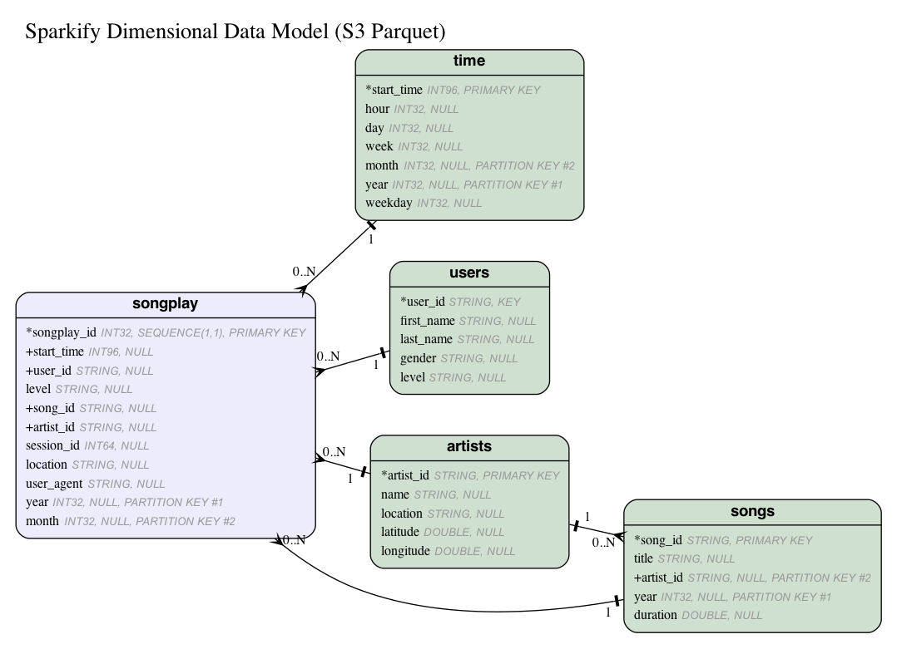

# Million Song Dataset JSON -> Spark on AWS EMR -> AWS S3

Load data from the [Million Song Dataset](https://labrosa.ee.columbia.edu/millionsong/) into a final dimensional model stored in S3. 

## Introduction

A fictional music streaming startup, Sparkify, has grown their user base and song database and want to move their processes and data onto the cloud. Their data resides in S3, in a directory of JSON logs on user activity on the app, as well as a directory with JSON metadata on the songs in their app. The files in this repository will assist in loading the data into a final dimensional model stored in Amazon S3.

## Design - Dimensional Model & ETL

Data is extracted from AWS S3 JSON files and inserted into the dimensional model shown below.

#### Design Decisions

* The `songplays` parquet file is partitioned by `year` and `month`
* The `time` parquet file is partitioned by `year` and `month`
* The `songs` parquet file is partitioned by `year` and `artist_id`

## Files

* dimensional_model.er
  * Entity-relationship file used to generate ER diagram images. See https://github.com/kaishuu0123/vscode-erd
* etl.py
  * Create parquet files for dimensional model & store to Amazon S3
* run_etl.py
  * Optional: create AWS EMR cluster and run etl.py
* install-requirements.sh
  * Bash script to install necessary python3 packages to run etl.py
* dl.cfg
  * Config file for all necessary variables for AWS EMR

## Installation

Clone this repository:

`git clone https://github.com/rigganni/AWS-Spark-Million-Song-ETL`

Set up the following variables in dl.cfg:

| variable | description |
| ------------ | --------- |
| AWS_ACCESS_KEY_ID | AWS access key |
| AWS_SECRET_ACCESS_KEY | AWS secret key |
| AWS_REGION | **us-west-2** as source S3 bucket is located in that region |
| AWS_S3_LOG_URI  | Logging location for EMR stdout, stderr, etc. |
| AWS_EC2_KEY_NAME | optional: use if utilizing run_etl.py |
| AWS_EC2_SUBNET_ID  | optional: use if utilizing run_etl.py |
| AWS_MASTER_PRIVATE_IP | opitonal: use if utilizing run_etl.py & want to assign private ip address |
| AWS_HDFS_ADDRESS_PORT | specify HDFS address & port |

## Usage

Ensure variables are set up in dl.cfg as described in installation above.

Optional: Create EMR cluster with `run_etl.py` and run `etl.py`. After `etl.py` completes cluster terminates.

`python run_etl.py`

Or run `etl.py` on existing AWS EMR cluster:

`python etl.py`